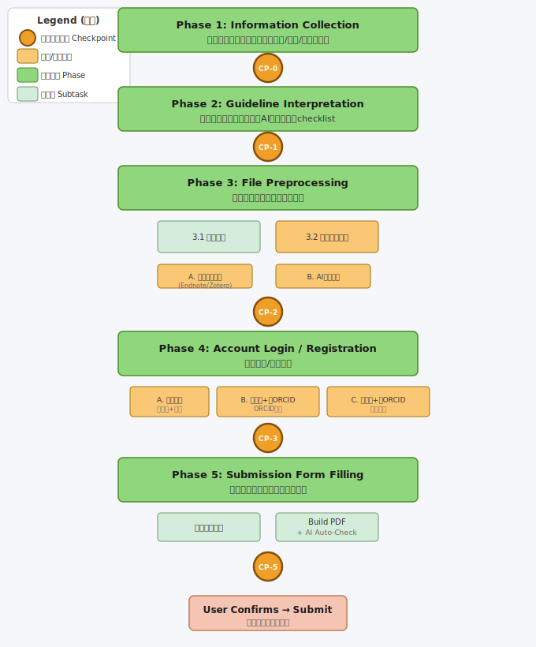

# paper-submission

> Automated manuscript submission skill for WorkBuddy — supports Editorial Manager, ScholarOne, Frontiers, Nature series, and other major submission systems.

[](https://www.codebuddy.cn)
[](LICENSE)
[](https://github.com/lunarcryxx/paper-submission-skill/releases)

## Features

- **5-Phase Automated Workflow**: Information collection → Guideline interpretation → File preprocessing → Account login/registration → Submission form filling
- **6 Human Checkpoints**: Review and confirm at every critical stage before proceeding
- **Multi-System Support**: Editorial Manager, ScholarOne, Frontiers, Nature series, and custom systems
- **Smart File Preprocessing**: Automatic anonymization, Cover Letter adaptation, reference format conversion
- **Bilingual Templates**: Author info, funding info, and reviewer recommendation templates with Chinese/English headers
- **AI-Powered Checklist**: Automatic validation before final submission

## Workflow Overview



*Figure: Complete submission workflow with 5 phases, 6 checkpoints (CP-0 to CP-5), and mandatory human gate at final submission.*

## Prerequisites

- [WorkBuddy](https://www.codebuddy.cn) (desktop or cloud)
- `playwright-cli` skill (automatically detected and installed if missing)

## Installation

### Option 1: Install via GitHub URL (Recommended)

```bash
# In WorkBuddy, tell your AI assistant:
"Install skill from GitHub: https://github.com/lunarcryxx/paper-submission-skill"
```

### Option 2: Manual Installation

1. Download the latest release: [paper-submission-v1.1.0.zip](https://github.com/lunarcryxx/paper-submission-skill/releases/tag/v1.1.0)
2. In WorkBuddy, tell your AI assistant:
   ```
   "Install the skill from this zip file: /path/to/paper-submission-v1.1.0.zip"
   ```

### Option 3: Clone and Install Locally

```bash
git clone https://github.com/lunarcryxx/paper-submission-skill.git
# In WorkBuddy:
"Install the skill from this directory: ./paper-submission-skill"
```

## Quick Start

### Trigger

Simply say one of the following to your WorkBuddy assistant:

- "帮我投稿到 [journal name]"
- "submit my paper to [journal name]"
- "使用 paper-submission 技能"

### Before You Start

Prepare the following materials:

| Material | Required? | Notes |
|----------|-----------|-------|
| Journal name + submission system URL | ✅ Yes | e.g., "Nature Communications, https://submission.nature.com" |
| Manuscript file (.docx) | ✅ Yes | Your main manuscript |
| Cover Letter | ✅ Yes | Tailored to the target journal |
| Author information | ✅ Yes | Fill in `assets/author_info_template.xlsx` |
| Funding information | ✅ Yes | Fill in `assets/funding_info_template.xlsx` |
| Reviewer recommendations | Optional | Fill in `assets/reviewer_info_template.xlsx` |
| Title Page | If double-blind | Separate file with author details |
| Figures/Tables | Optional | High-resolution images |
| Account credentials | ✅ Yes | See login paths below |

### Account Login Paths

The skill handles three scenarios automatically:

| Scenario | What to Provide |
|----------|-----------------|
| **A: Existing account** | Username + Password |
| **B: No account, has ORCID** | ORCID account credentials |
| **C: No account, no ORCID** | Email, name, institution, department, country, password |

## Checkpoint System

The skill pauses at 6 checkpoints for your review:

| Checkpoint | Stage | What to Review |
|------------|-------|----------------|
| **CP-0** | After information collection | All materials are complete |
| **CP-1** | After guideline interpretation | AI's understanding of journal requirements |
| **CP-2** | After file preprocessing | Anonymization results, reference format (varies by journal) |
| **CP-3** | After account login | Registration/login information |
| **CP-4** | After author info filled | Author order and details |
| **CP-5** | After Build PDF | AI auto-checklist results + PDF content → Final confirmation before submit |

At each checkpoint, you can:
- **Confirm** → Proceed to next stage
- **Request changes** → Modify specific items
- **Abort** → Stop the entire process

## Templates

### Author Information (`assets/author_info_template.xlsx`)

| Column | Description | Example |
|--------|-------------|---------|
| Is Corresponding Author | Enter "Yes" for corresponding author | Yes |
| Author Order | Sequence number | 1 |
| Title | Academic title | Dr. |
| Given Name / First Name | First name | John |
| Middle Initial | Middle initial (optional) | A |
| Family Name / Surname | Last name | Smith |
| Email | Email address | john@example.com |
| Telephone | Phone (corresponding author only) | +1-234-567-8900 |
| Institution | Primary institution | Harvard University |
| Department | Department | Biology |
| Address Line 1 | Street address | 1 Oxford Street |
| Address Line 2 | Apt/Suite (optional) | |
| City | City | Cambridge |
| State/Province | State or province | MA |
| Zip/Postal Code | Postal code | 02138 |
| Country | Country | USA |
| ORCID | ORCID iD (optional) | 0000-0001-2345-6789 |

> **Multiple affiliations?** Fill only one primary affiliation here. Additional affiliations can be listed in the manuscript's Title Page. The submission system only requires one affiliation per author.

### Funding Information (`assets/funding_info_template.xlsx`)

| Column | Description | Example |
|--------|-------------|---------|
| Sequence Number | Order | 1 |
| Funder Name (English) | Full name in English | National Natural Science Foundation of China |
| Grant Number | Award/grant number | 66668888 |
| Grant Recipient | Must be an author of this paper | San Zhang |

### Reviewer Recommendation (`assets/reviewer_info_template.xlsx`)

| Column | Description | Example |
|--------|-------------|---------|
| Sequence Number | Order | 1 |
| First Name / Given Name | First name | Anna |
| Family Name / Surname | Last name | Müller |
| Email | Email address | anna@example.de |
| Institution | Institution | Charité Berlin |
| Department | Department | Bioinformatics |
| Country | Country | Germany |
| Research Area / Reason | Expertise or reason for recommendation | Single-cell genomics |

## Supported Submission Systems

| System | Status | Notes |
|--------|--------|-------|
| Editorial Manager | ✅ Full support | Most widely used |
| ScholarOne | ✅ Supported | Taylor & Francis, IEEE, etc. |
| Frontiers | ✅ Supported | Frontiers series journals |
| Nature Portfolio | ✅ Supported | Nature and sub-journals |
| Others | ⚠️ Partial | Adapts to actual system steps |

## FAQ

**Q: What if the submission system has different steps than described?**
A: The skill follows the **actual system steps** it encounters. Phase 5 is designed generically — it doesn't assume specific tab names or order.

**Q: Does the skill support Chinese journals?**
A: Yes. All templates have bilingual (Chinese/English) headers. The workflow is system-agnostic.

**Q: Can I skip anonymization if the journal doesn't require it?**
A: Yes. CP-2 reminds you to check what was actually modified. If the journal doesn't require double-blind review, skip anonymization.

**Q: What about reference format conversion?**
A: At CP-2, you can choose: (A) convert yourself using Endnote/Zotero, or (B) let the AI convert based on the journal's guidelines.

**Q: Is my manuscript data secure?**
A: All processing happens locally on your machine. No data is sent to external servers beyond the submission system itself.

**Q: Can I update the skill later?**
A: Yes. Re-download the latest release or pull from this repository, then reinstall.

## Version History

| Version | Date | Changes |
|---------|------|---------|
| v1.1.1 | 2026-07-07 | ⛔ Mandatory human gate: AI is FORBIDDEN from clicking the final submit button; must generate a full review report and wait for user to submit manually; added 3 enforcement points across SKILL.md |
| v1.1.0 | 2026-07-03 | Merged CP-5/CP-6 into unified CP-5 with AI auto-checklist; reviewer template split Full Name into First/Family Name; removed Publication Name column; added Initialization Check for playwright-cli dependency |
| v1.0.0 | 2026-07-02 | Initial release: 5-phase workflow, 7 checkpoints, bilingual templates, Editorial Manager guide |

## Contributing

Contributions welcome! Please open an issue or pull request at:
https://github.com/lunarcryxx/paper-submission-skill

## License

MIT License. See [LICENSE](LICENSE) for details.

## Author

Created by **Xiao Xiao** with WorkBuddy AI assistant.
